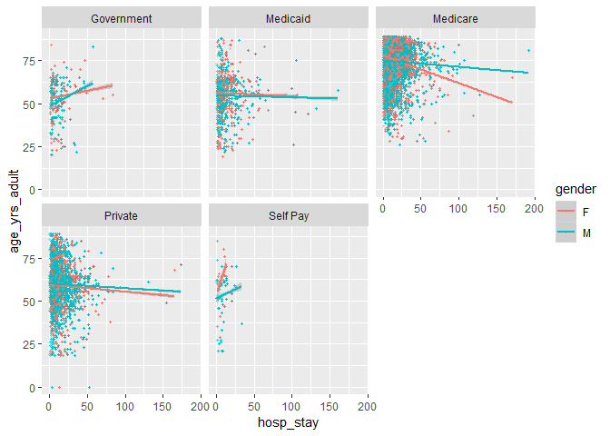

Plot for MIMIC data
================
Sukhpal Rapal
7/23/2018

Importing R object created earlier for plotting:

``` r
load("data.rdat")
data = mimic_thrombocytopenia2_df
```

Plotting various columns of the MIMIC dataframe for better
understanding:

<!-- -->
