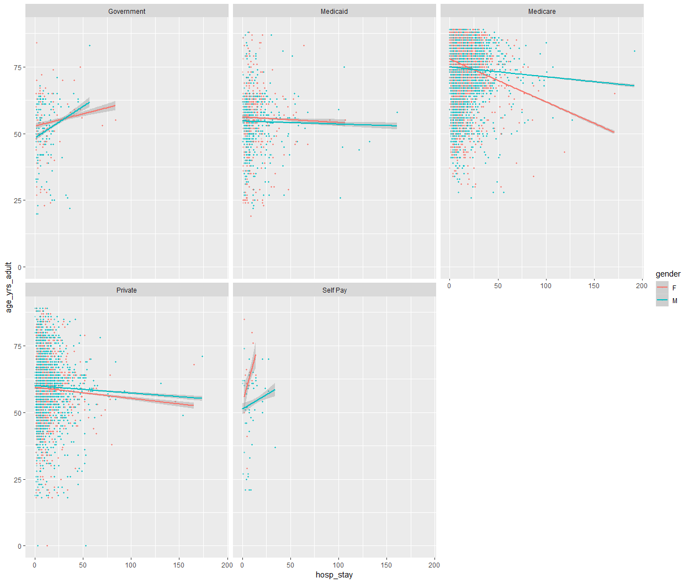

Plot for MIMIC data
================
Sukhpal Rapal
7/23/2018

Importing R object created earlier for plotting:

``` r
load("data.rdat")
data = mimic_thrombocytopenia2_df
```

Plotting various columns of the MIMIC dataframe for better
understanding:

``` r
data %>% filter(age_yrs_adult < 100, hosp_stay < 200) %>% 
  ggplot(aes(x = hosp_stay, y = age_yrs_adult, col = gender )) +
  geom_point(size = .7, alpha = 0.3) +
  geom_smooth(method = lm) +
  facet_wrap(~insurance)
```


